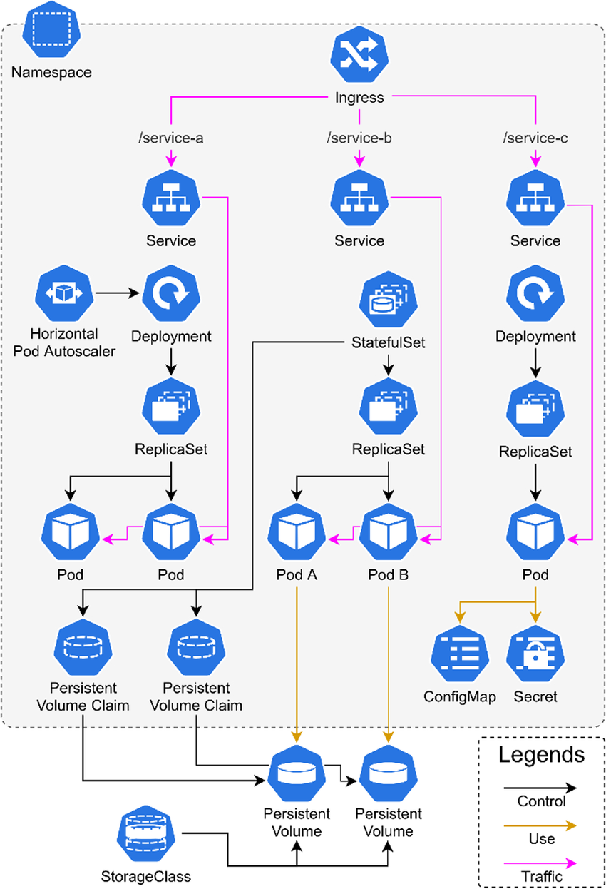

#### [Back](./README.md)

# Kubernetes Resources

In K8, a resource is an endpoint in kubernetes API that stores a collection of API object of a certain kind. Here are the different type of resources in Kubernetes.

### Workload Resources
1. **[Pods](./Pods.md):-** A basic execution unit in k8, comprising one or more containers.
2. **[ReplicaSets](./ReplicaSets.md):** Ensure a specified number of replicas(identical pods) are running at any given time.
3. **[Deployments](./Deployments.md):** Manage rollouts and rollbacks of Pods and ReplicaSets.
4. **[StatefulSets](./StatefulSets.md):** Manage stateful applications, such as databases, with persistent storage and network identities.
5. **[DaemonSets](./DaemonSets.md):** Ensure a specific Pod runs on each node in a cluster.
6. **[Jobs](./Jobs.md):** Run batch processing workloads, such as data processing or scientific simulations.
7. **[CronJobs](./CronJobs.md):** Schedule Jobs to run at specific times or intervals.

### Service Resources
1. **[Services](./Services.md):** Provide a network identity and load balancing for accessing Pods.
2. **[Ingress](./Ingress.md):** Manage incoming HTTP requests and route them to appropriate Services.
3. **[IngressClass](./IngressClass.md):** Define a class of Ingresses that can be implemented by different controllers.

### Storage Resources
1. **[Persistent Volumes (PVs)](./PersistentVolumes.md):** Provide persistent storage for Pods.
2. **[Persistent Volume Claims (PVCs)](./PersistentVolumesClaims.md):** Request storage resources from PVs.
3. **[Storage Classes](./StorageClasses.md):** Define storage classes that can be used to dynamically provision PVs.
4. **[VolumeSnapshots](./VolumnSnapshots.md):** Create snapshots of PVs for backup and restore purposes.

### Configuration Resources
1. **[ConfigMaps](./ConfigMaps.md):** Store configuration data as key-value pairs that can be injected into Pods.
2. **[Secrets](./Secrets.md):** Store sensitive data, such as passwords and API keys, that can be injected into Pods.

### Cluster Resources
1. **[Namespaces](./Namespaces.md):** Partition resources and provide isolation between different applications or teams.
2. **ResourceQuotas:** Define quotas for resources, such as CPU and memory, within a Namespace.
3. **LimitRanges:** Define constraints on resource usage, such as minimum and maximum CPU and memory, within a Namespace.
4. **[Nodes](./Nodes.md):** Represent individual machines in a Kubernetes cluster.
5. **ClusterRoles:** Define permissions for cluster-wide resources.
6. **ClusterRoleBindings:** Bind ClusterRoles to users or service accounts.

