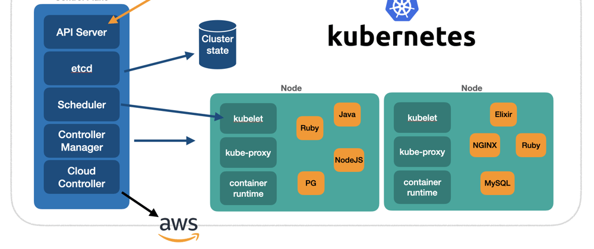

#### [Back](../README.md)

# Kubernetes K8

### [Installing Kubernetes](./Installing-Kubernetes.md)

### [Kubernetes Resources](./Kubernetes-Resources.md)

### [Monitoring Kubernetes Cluster](./Monitoring.md)

### [Troubleshoot Kubernete Cluster](./Troubleshoot.md)
---------------------
---------------------

* **[Kubecost](./Kubecost.md)**
* **[Helm Chart](./HelmChart.md)**
* **[Prometheus](./Prometheus.md)**