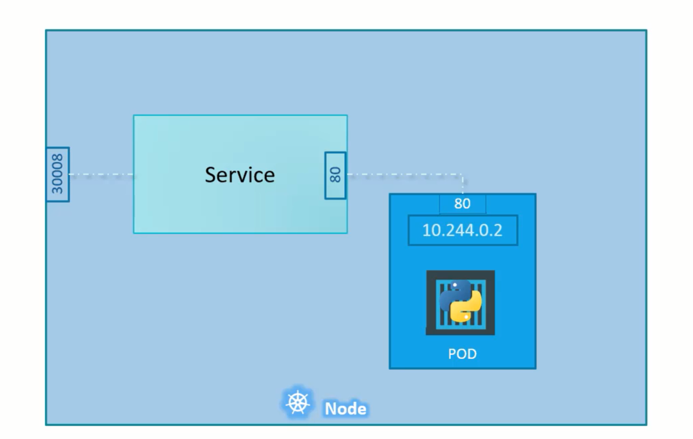

#### [Back](./Kubernetes-Resources.md)
<style>
  img {
    width: 90%;
  }
</style>
# K8 Service

A Service in Kubernetes is an abstract resource that provides a network identity and load balancing for accessing a group of pods. Services enable communication between pods and other services, and provide a stable network identity for accessing applications.

## Types of Services
There are several types of Services in Kubernetes:

1. **ClusterIP:** Exposes the service on a cluster-internal IP address.

2. **NodePort:** Exposes the service on a specific port on each node in the cluster.


```yaml
apiVersion: v1
kind: Service
metadata: 
  name: myapp-service

spec:
  type: NodePort
  ports:
    - targetPort: 80 # will assumed to be same as port by default
      port: 80  # only mandatory
      nodePort: 30008 #if not provided, it will automatically assign the port in the valid range.
  selector:
  # to identify the pod
    app: myapp
    type: front-end
```

3. **LoadBalancer:** Exposes the service through a cloud provider's load balancer.

4. **ExternalName:** Maps the service to a DNS name.

## Characteristics of Services
Here are some key characteristics of Services:

+ **Stable network identity:** Services provide a stable network identity for accessing applications.

+ **Load balancing:** Services provide load balancing for accessing pods.

+ **Session persistence:** Services can provide session persistence for accessing pods.

+ **IP addresses and ports:** Services have IP addresses and ports that can be used to access them.

```yaml
apiVersion: v1
kind: Service
metadata:
  name: my-service
spec:
  selector:
    app: my-app
  ports:
  - name: http
    port: 80
    targetPort: 8080
  type: ClusterIP
```  

```bash
kubectl apply -f my-service.yaml
```