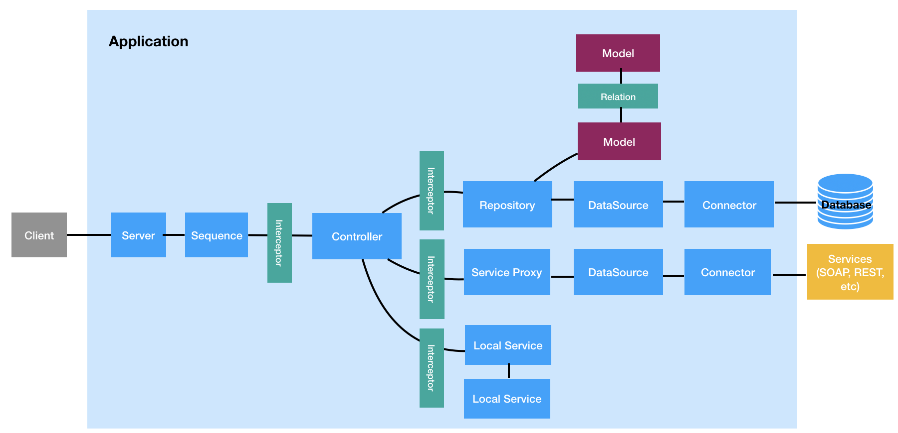

#### [Back](./README.md)

# Building Blocks

* **Application** The central class for setting up all of your module’s components, controllers, servers and bindings. The Application class extends Context and provides the controls for starting and stopping its associated servers.

* **Server**  An implementation for inbound transports/protocols such as REST (http, https), gRPC (http2) and graphQL (http, https). It typically listens on a specific endpoint (protocol/host/port), handles incoming requests, and then returns appropriate responses.

* **Controller** A class that implements operations defined by the application’s REST API. It implements an application’s business logic and acts as a bridge between the HTTP/REST API and domain/database models. A Controller operates only on processed input and abstractions of backend services / databases.

* **Interceptor** A function that intercepts static or instance method invocations on a class or object.

* **Route** The mapping between your API specification and an Operation. It tells LoopBack which Operation to invoke() when given an HTTP request.

* **Sequence** A stateless grouping of Actions that control how a Server responds to requests.

* **Model** The definition of an object in respect to the datasource juggler. The @loopback/repository module provides special decorators for adding metadata to TypeScript/JavaScript classes to use them with DataSource Juggler. In addition, @loopback/repository-json-schema module uses the decorators’ metadata to build a matching JSON Schema.

* **DataSource** A named configuration for a Connector instance that represents data in an external system.

* **Repository** A type of service that represents a collection of data within a DataSource.

* **Relation** A mapping between two models which describes a real world link between them and exposes CRUD APIs based on the configuration.

* **Decorator** The pattern used to annotate or modify your class declarations and their members with metadata.

## Here are the infrastructures that get all the artifacts working together:

* **Context** An abstraction of states and dependencies in your application that LoopBack uses to manage everything. It’s a global registry for everything in your app (configurations, state, dependencies, classes and so on).

* **Binding** An abstraction of items managed by a context. Each binding has a unique key within the context and a value provider to resolve the key to a value.

* **Dependency Injection** The technique used to separate the construction of dependencies of a class or function from its behavior to keep the code loosely coupled.

* **Components** A package that bundles one or more LoopBack extensions.

