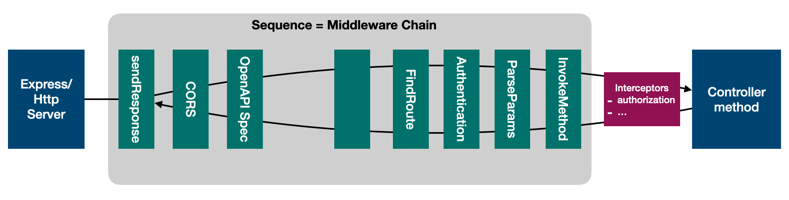

#### [Back](./README.md)

# Sequence

A Sequence is a series of steps to control how a specific type of Server responds to incoming requests. Each types of servers, such as RestServer, GraphQLServer, GRPCServer, and WebSocketServer, will have its own flavor of sequence. The sequence represents the pipeline for inbound connections.

The contract of a Sequence is simple: it must produce a response for a request. The signature will vary by server types.

Each server type has a default sequence. It’s also possible to create your own Sequence to have full control over how your Server instances handle requests and responses.

When a LoopBack application is scaffolded using lb4 app command, a MySequence class is generated in src/sequence.ts.

```typescript
import {MiddlewareSequence} from '@loopback/rest';

export class MySequence extends MiddlewareSequence {}
```

MySequence is then used by the RestApplication in src/application.ts:
```typescript
this.sequence(MySequence);
```

The middleware-based sequence itself is basically a named middleware chain. Each middleware serves as an action within the sequence. The handle function executes registered middleware in cascading fashion.

```typescript
/**
 * A sequence implementation using middleware chains
 */
export class MiddlewareSequence implements SequenceHandler {
  static defaultOptions: InvokeMiddlewareOptions = {
    chain: 'middlewareChain.rest',
    orderedGroups: [
      // Please note that middleware is cascading. The `sendResponse` is
      // added first to invoke downstream middleware to get the result or
      // catch errors so that it can produce the http response.
      'sendResponse',

      // default
      'cors',
      'apiSpec',

      // default
      'middleware',

      // rest
      'findRoute',

      // authentication
      'authentication',

      // rest
      'parseParams',
      'invokeMethod',
    ],
  };

  /**
   * Constructor: Injects `InvokeMiddleware` and `InvokeMiddlewareOptions`
   *
   * @param invokeMiddleware - invoker for registered middleware in a chain.
   * To be injected via SequenceActions.INVOKE_MIDDLEWARE.
   */
  constructor(
    @inject(SequenceActions.INVOKE_MIDDLEWARE)
    readonly invokeMiddleware: InvokeMiddleware,
    @config()
    readonly options: InvokeMiddlewareOptions = MiddlewareSequence.defaultOptions,
  ) {}

  /**
   * Runs the default sequence. Given a handler context (request and response),
   * running the sequence will produce a response or an error.
   *
   * @param context - The request context: HTTP request and response objects,
   * per-request IoC container and more.
   */
  async handle(context: RequestContext): Promise<void> {
    debug(
      'Invoking middleware chain %s with groups %s',
      this.options.chain,
      this.options.orderedGroups,
    );
    await this.invokeMiddleware(context, this.options);
  }
}
```



